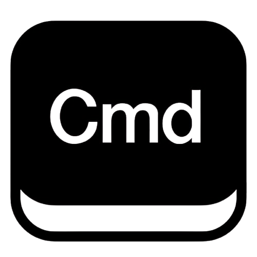

<p>
  
</p>

# @cmd-kit/core

[](https://www.npmjs.com/package/@cmd-kit/core)


Core engine for Cmd+kit. Includes headless primitives and framework-free browser runtime (`createCommandPalette`).

## 🌐 Language

- [Español](#-español)
- [English](#-english)

---

## 🇪🇸 Español

### ⚡ Instalación

```bash
npm install @cmd-kit/core
```

### ✅ Qué incluye

- Modelo de comandos (`items`, `sections`, `children`).
- Snapshot + fuzzy filtering.
- Ejecución de comandos (`href`, callback, navegación).
- Recientes (`recordRecentCommand`, `resolveRecentCommands`).
- Helpers de tema/mensajes.
- Soporte de tema simple o dual (`theme.light` / `theme.dark`).
- Runtime vanilla completo: `createCommandPalette`.
- Opción `reducedMotion` para desactivar animaciones de hover/movimiento.

### 🚀 Opción 1: motor headless

```ts
import {
  createCommandSnapshot,
  createResolvedConfig,
  dispatchCommandExecution
} from "@cmd-kit/core";

const config = createResolvedConfig({
  sections: [
    {
      id: "navigation",
      title: "Navigation",
      items: [{ id: "home", title: "Dashboard", href: "/dashboard" }]
    }
  ]
});

const snapshot = createCommandSnapshot(config, "dash");

await dispatchCommandExecution({
  item: snapshot.items[0],
  port: {
    openHref: ({ href }) => window.location.assign(href)
  }
});
```

### 🧱 Opción 2: runtime vanilla (sin framework)

```ts
import { createCommandPalette } from "@cmd-kit/core";

const palette = createCommandPalette({
  title: "Command menu",
  defaultOpen: false,
  reducedMotion: false,
  recents: { limit: 6, sectionTitle: "Recent commands" },
  theme: {
    light: { accentColor: "#0fa6d8", backgroundColor: "#ffffff" },
    dark: { accentColor: "#35d7ff", backgroundColor: "#0b1116" }
  }
});

// API runtime
palette.setOpen(true);
palette.toggle();
palette.reloadSource();
```

### 🛝 Integración desde Playground

Si tu objetivo es `core`:

1. Diseña estructura en playground.
2. Exporta `Core (Vanilla JS)`.
3. Usa la salida para:
   - `createResolvedConfig` (headless), o
   - `createCommandPalette` (runtime vanilla).

### 🧠 Cuándo usar core

- Quieres construir tu propia UI.
- Necesitas integración sin React/Vue/Preact/Astro.
- Quieres reutilizar solo motor + ejecución + filtros.

### 🤝 Contribuciones

PRs bienvenidas, especialmente en rendimiento, estabilidad del motor y extensibilidad.

---

## 🇬🇧 English

### ⚡ Install

```bash
npm install @cmd-kit/core
```

### ✅ What you get

- Command model (`items`, `sections`, `children`).
- Snapshot + fuzzy search pipeline.
- Command execution primitives.
- Recents helpers.
- Theme/messages helpers.
- Single or dual theme mode support (`theme.light` / `theme.dark`).
- Full framework-free runtime via `createCommandPalette`.
- `reducedMotion` option to disable hover/motion animations.

### 🚀 Option 1: headless engine

Use `createResolvedConfig` + `createCommandSnapshot` + `dispatchCommandExecution`.

### 🧱 Option 2: vanilla runtime

Use `createCommandPalette` to mount a ready runtime without framework dependencies.

### 🛝 Playground integration

Export `Core (Vanilla JS)`, then map output into either headless config or `createCommandPalette`.

### 🤝 Contributing

PRs are welcome, especially around performance, core stability, and API extension points.

---

Portfolio: **Fr4n0m** → https://codebyfran.es
